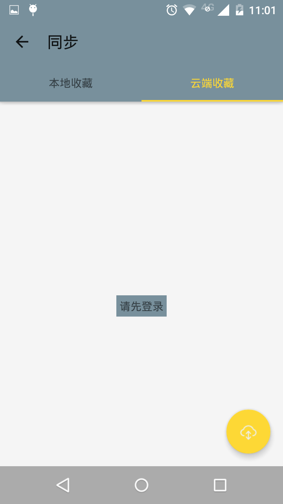

##Moose

A material-design of [Acfun](http://acfun.tudou.com/) Article area.

**Build** 

    ./gradlew assembleDebug

Supply your own release signing config to build release.

**Coverage** 

    ./gradlew jacocoTestReport

**Dependencies**

- AOSP [appcompat-v7](https://developer.android.com/tools/support-library/features.html#v7-appcompat)
/ [recyclerview-v7](https://developer.android.com/tools/support-library/features.html#v7-recyclerview)
/ [cardview-v7](https://developer.android.com/tools/support-library/features.html#v7-cardview)
/ [design](https://developer.android.com/intl/zh-cn/tools/support-library/features.html#design)
/ [preference](https://developer.android.com/tools/support-library/features.html#v7-preference)
/ [chrome custom tabs](https://github.com/GoogleChrome/custom-tabs-client)
- Square [Retrofit](https://github.com/square/retrofit) / [OkHttp](https://github.com/square/okhttp)
- [RxJava](https://github.com/ReactiveX/RxJava) / [RxAndroid](https://github.com/ReactiveX/RxAndroid) / [RxLifecycle](https://github.com/trello/RxLifecycle)
- [retrolambda](https://github.com/orfjackal/retrolambda)
- [jsoup](https://github.com/jhy/jsoup)
- [glide](https://github.com/bumptech/glide)
- [leakcanary](https://github.com/square/leakcanary)
- [Robolectric](https://github.com/robolectric/robolectric)

**Thanks to**

- [materialistic](https://github.com/hidroh/materialistic)

### Screenshots

### License
    Copyright 2015 Farble Dast

    Licensed under the Apache License, Version 2.0 (the "License");
    you may not use this file except in compliance with the License.
    You may obtain a copy of the License at

        http://www.apache.org/licenses/LICENSE-2.0

    Unless required by applicable law or agreed to in writing, software
    distributed under the License is distributed on an "AS IS" BASIS,
    WITHOUT WARRANTIES OR CONDITIONS OF ANY KIND, either express or implied.
    See the License for the specific language governing permissions and
    limitations under the License.
